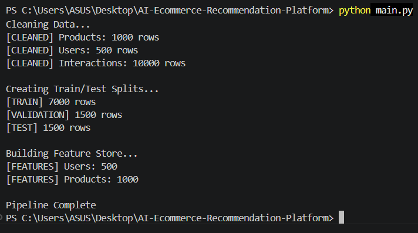
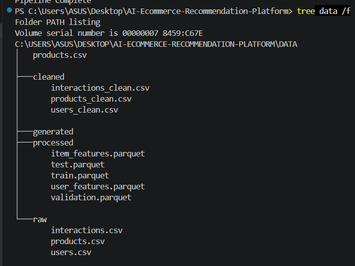
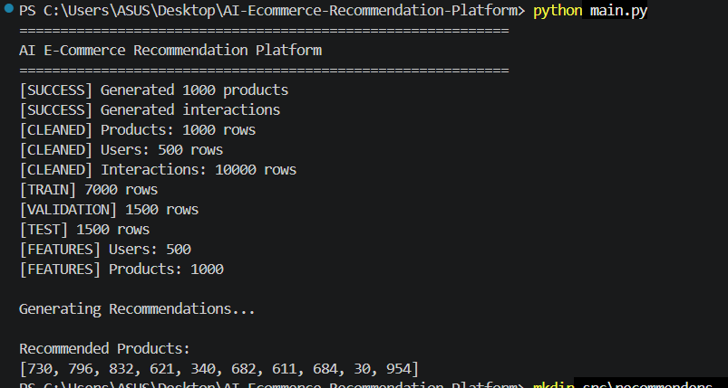
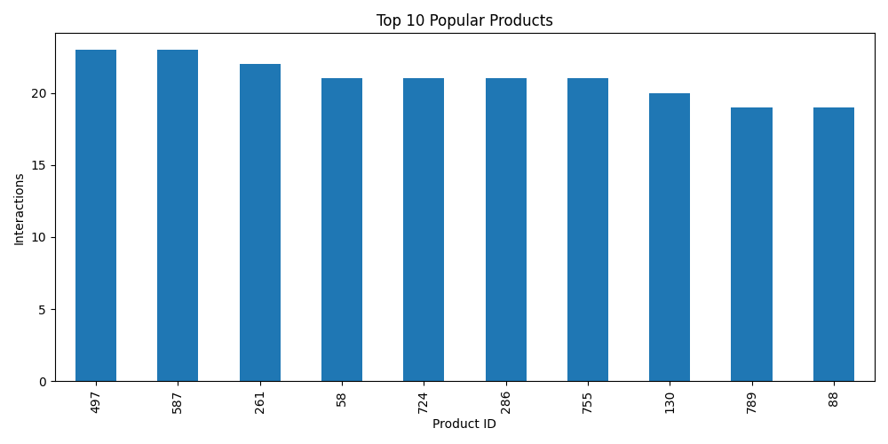
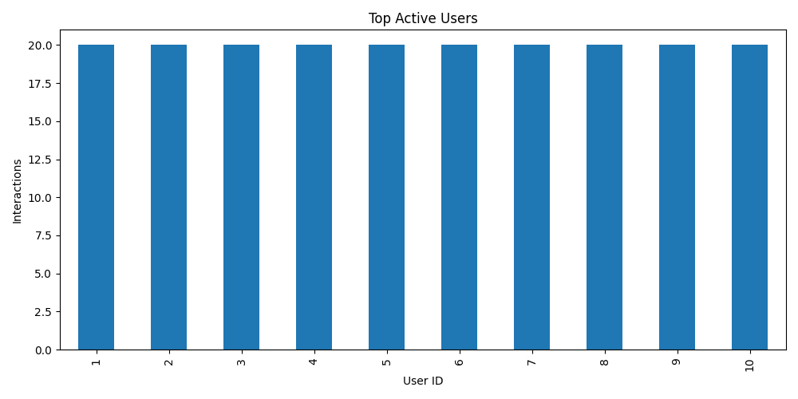
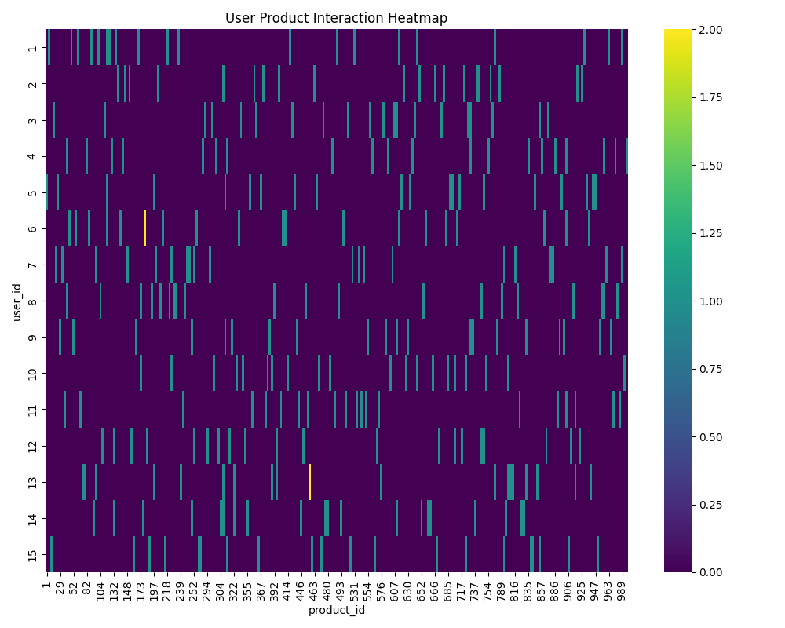

# 🚀 AI E-Commerce Recommendation Platform


---

## 📌 Overview

AI E-Commerce Recommendation Platform is a complete end-to-end recommendation system built using Python and Machine Learning concepts.

The project automatically:

* Generates synthetic e-commerce datasets
* Cleans and preprocesses data
* Creates feature stores
* Builds recommendation engines
* Evaluates recommendation quality
* Generates visual analytics
* Produces PDF reports

The architecture is inspired by production-style recommendation systems used in modern e-commerce platforms.

---

# 🏗 Architecture

```text
Raw Data Generation
        │
        ▼
Data Cleaning
        │
        ▼
Feature Engineering
        │
        ▼
Train / Validation / Test Split
        │
        ▼
Recommendation Engine
 ├─ Collaborative Filtering
 ├─ Content-Based Filtering
 └─ Hybrid Recommender
        │
        ▼
Evaluation Metrics
 ├─ Precision@K
 ├─ Recall@K
 └─ NDCG@K
        │
        ▼
Visualization Layer
        │
        ▼
PDF Report Generation
```

---

# ✨ Features

### Dataset Generation

* Synthetic Product Generation
* Synthetic User Generation
* User Interaction Simulation

### Data Engineering

* Data Cleaning
* Duplicate Removal
* Feature Store Creation
* Dataset Splitting

### Recommendation Engine

* Collaborative Filtering
* Content-Based Recommendation
* Hybrid Recommendation System

### Evaluation

* Precision@K
* Recall@K
* NDCG@K

### Analytics

* Popularity Charts
* User Activity Charts
* Interaction Heatmaps

### Reporting

* Automated PDF Report Generation

---

# 📂 Project Structure

```text
AI-Ecommerce-Recommendation-Platform

│
├── data
│   ├── raw
│   ├── cleaned
│   └── processed
│
├── outputs
│   ├── reports
│   └── screenshots
│
├── src
│   ├── generators
│   ├── preprocessing
│   ├── recommenders
│   ├── evaluation
│   ├── visualization
│   └── reporting
│
├── README.md
├── requirements.txt
├── .gitignore
└── main.py
```

---

# 📊 Dataset Statistics

| Metric       | Value |
| ------------ | ----- |
| Products     | 1000  |
| Users        | 500   |
| Interactions | 10000 |

---

# 📈 Evaluation Metrics

Generated automatically:

```text
Precision@10
Recall@10
NDCG@10
```

Example Output:

```text
Precision@10 : 0.0
Recall@10    : 0.0
NDCG@10      : 0
```

---

# 🖼 Generated Visualizations

The system automatically generates:

```text
outputs/screenshots/

popularity_chart.png

user_activity.png

interaction_heatmap.png
```

---

# 📷 Project Screenshots

## Dataset Pipeline



---

## Data Structure



---

## Recommendation Results



---

## Product Popularity Analysis



---

## User Activity Analysis



---

## Interaction Heatmap



---

# 📄 Generated Reports

Automatically generated:

```text
outputs/reports/project_report.pdf
```

Contains:

* Dataset Statistics
* Recommendation Results
* Evaluation Metrics
* Analytics Summary
* Project Overview

---

# ⚙ Installation

```bash
git clone https://github.com/vyawaha/ai-ecommerce-recommendation-platform.git

cd AI-Ecommerce-Recommendation-Platform

pip install -r requirements.txt
```

---

# ▶ Run

```bash
python main.py
```

---

# 🎯 Skills Demonstrated

* Python
* Machine Learning
* Recommender Systems
* Data Engineering
* Feature Engineering
* Data Visualization
* Software Architecture
* Analytics Reporting

---

# 🚀 Future Enhancements

* FAISS Vector Search
* LightGBM Ranking
* Neural Collaborative Filtering
* Real E-Commerce Dataset Integration
* REST API Deployment
* Docker Containerization
* CI/CD Pipeline

---

# 👨‍💻 Author

Muktai Vyawahare

Computer Science Engineering Student

Passionate about Machine Learning, AI Systems, Data Science, and Software Development.
